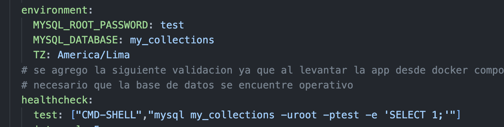
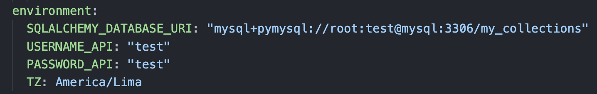
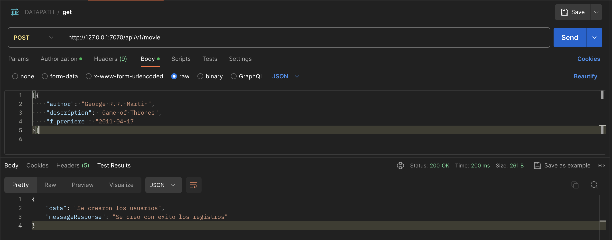
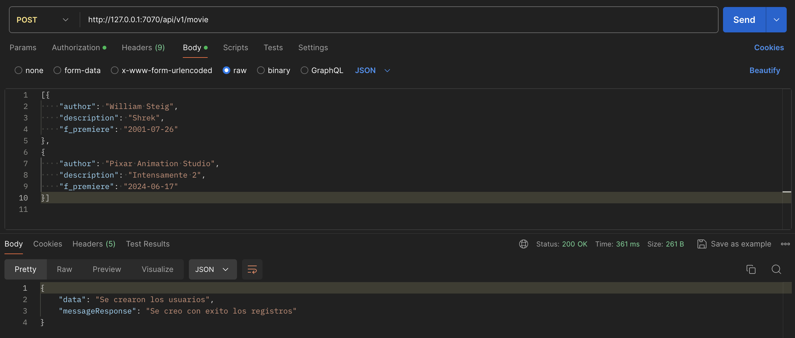
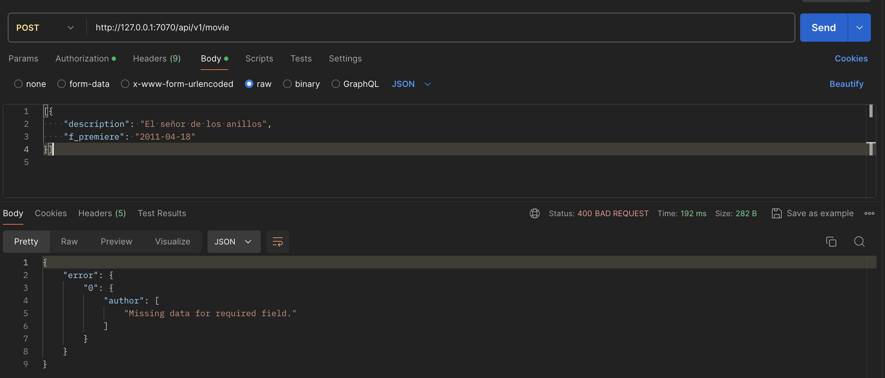
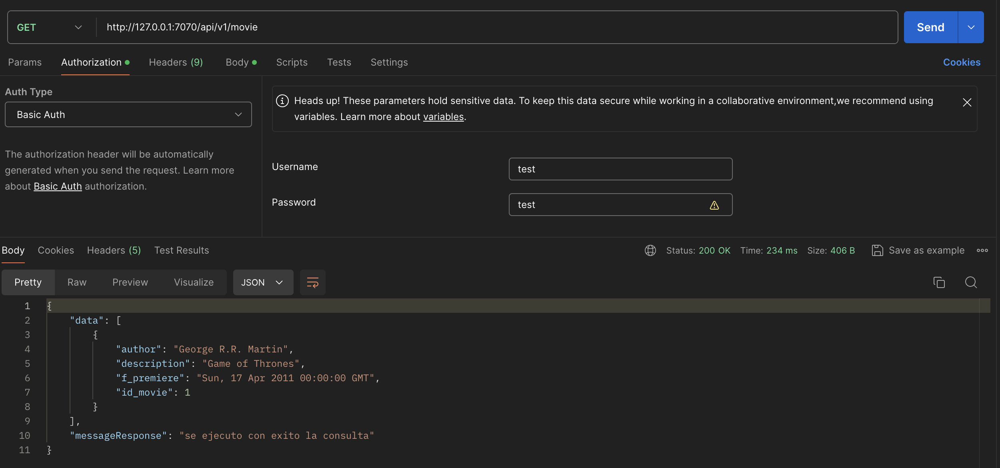
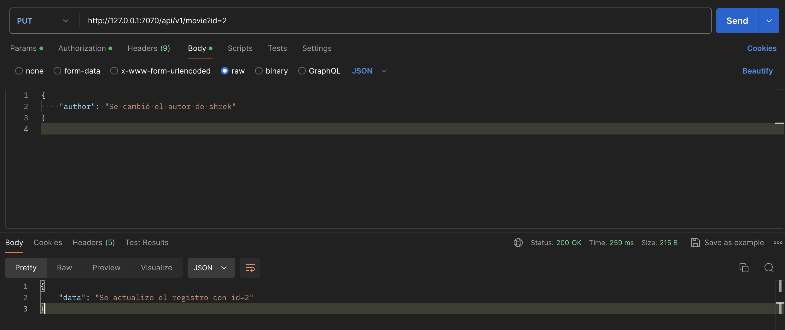
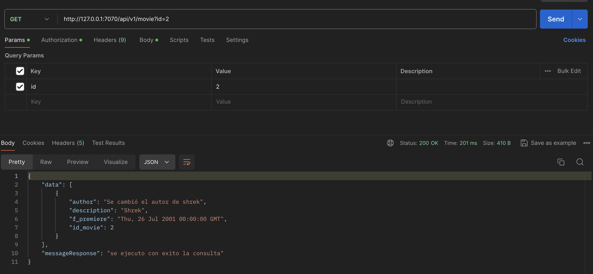
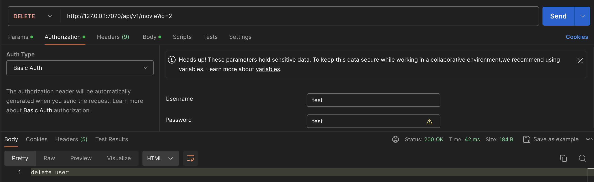
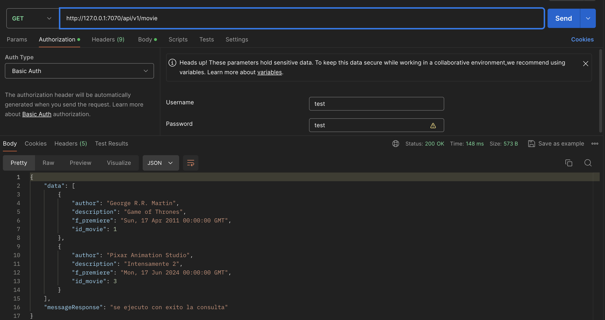

### DESPLEGAR ENTORNO EN DOCKER

* Crear la imagen de Flask que contiene la aplicacion a partir de un Dockerfile , se tagea la versión de la app (v1).

```
(flask_tarea) bryanalonso@MacBook-Pro-de-bryan flask_tarea % docker build -t flask-app:v1 .
[+] Building 12.0s (11/11) FINISHED                                                                                 docker:desktop-linux
 => [internal] load build definition from Dockerfile                                                                                0.0s
 => => transferring dockerfile: 207B                                                                                                0.0s
 => [internal] load metadata for docker.io/library/python:3.12.3                                                                    1.2s
 => [auth] library/python:pull token for registry-1.docker.io                                                                       0.0s
 => [internal] load .dockerignore                                                                                                   0.0s
 => => transferring context: 2B                                                                                                     0.0s
 => CACHED [1/5] FROM docker.io/library/python:3.12.3@sha256:3966b81808d864099f802080d897cef36c01550472ab3955fdd716d1c665acd6       0.0s
 => [internal] load build context                                                                                                   0.0s
 => => transferring context: 5.04kB                                                                                                 0.0s
 => [2/5] WORKDIR /datapath                                                                                                         0.0s
 => [3/5] COPY . .                                                                                                                  0.0s
 => [4/5] RUN pip3 install pipenv                                                                                                   6.1s
 => [5/5] RUN pipenv install --system --deploy --ignore-pipfile                                                                     4.3s 
 => exporting to image                                                                                                              0.2s 
 => => exporting layers                                                                                                             0.2s 
 => => writing image sha256:7be8aaaecc897f4ff1314df36b885eec92049800ca3b499fd3b1670fef8f7c36                                        0.0s 
 => => naming to docker.io/library/flask-app:v1                                                                                     0.0s 
                                                                                                                                         
View build details: docker-desktop://dashboard/build/desktop-linux/desktop-linux/dvv9me7g7bphny08zdleohw9z

What's Next?
  View a summary of image vulnerabilities and recommendations → docker scout quickview
```
* En el archivo docker-compose.yml , se encuentran configuradas las variables de entorno de la aplicacion y las credenciales de la base de datos. **Debe cambiarlas a su gusto**

 **Variables de entorno de la base de datos**

 

 **Variables de entorno del api Flask**

 

* Levantar la aplicacion y la base de datos ejecutando el docker-compose en background.

```
(flask_tarea) bryanalonso@MacBook-Pro-de-bryan flask_tarea % docker compose up -d
WARN[0000] /Users/bryanalonso/datapath/flask_tarea/docker-compose.yml: `version` is obsolete 
[+] Running 4/4
 ✔ Network red_interna                 Created                                                                                      0.0s 
 ✔ Volume "flask_tarea_storage_mysql"  Created                                                                                      0.0s 
 ✔ Container flask_tarea-mysql-1       Healthy                                                                                     10.7s 
 ✔ Container flask_tarea-flask-1       Started                                                                                     10.9s 
```

* Validar el estado de los contenedores

```
(flask_tarea) bryanalonso@MacBook-Pro-de-bryan flask_tarea % docker compose ps
WARN[0000] /Users/bryanalonso/datapath/flask_tarea/docker-compose.yml: `version` is obsolete 
NAME                  IMAGE          COMMAND                  SERVICE   CREATED              STATUS                        PORTS
flask_tarea-flask-1   flask-app:v1   "python3 app.py"         flask     About a minute ago   Up 52 seconds                 0.0.0.0:7070->7070/tcp
flask_tarea-mysql-1   mysql:latest   "docker-entrypoint.s…"   mysql     About a minute ago   Up About a minute (healthy)   0.0.0.0:3306->3306/tcp, 33060/tcp, 0.0.0.0:33060->3306/tcp
```

### PRUEBAS FUNCIONALES DEL API

* Tabla de metodos

| método |  url  |  resumen          |
|--------|-------|-------------------
|  GET   | http://<ip_servidor>:7070/api/v1/movie  | obtener los registros  |
|  POST  | http://<ip_servidor>:7070/api/v1/movie  | crear los registros, este método acepta un array de json con los campos  |
|  PUT  | http://<ip_servidor>:7070/api/v1/movie?id=1  |  actualizar los registros basado en id |
|  DELETE  | http://<ip_servidor>:7070/api/v1/movie?id=1  |  eliminar los registros basado en id|

* Autenticación del API: Considerar que se agregó un método de autenticación HTTPBasicAuthentication

##### METODO POST (CREAR REGISTROS PELICULAS)

* A continuación se muestra un ejemplo de compo cargar un registro de peliculas en la tabla:



* El API diseñada tambien permite cargar multiples registros de la siguiente manera:



* Se agregó un validador de esquemas en caso se intenten cargar registros inválidos (Se observa que falta el campo author, por lo que cae en una excepción).



##### METODO GET (LISTAR REGISTRO PELICULAS)

* Se muestra la siguiente consulta que trae los registros de la tabla my_collections



##### METODO PUT (ACTUALIZAR REGISTRO DE PELICULA)

* El siguiente método se utilizar para actualizar los registros de la tabla de peliculas basandose en el id



* Se valida el cambio del registro id=2



##### METODO DELETE (ELIMINAR REGISTRO DE PELICULA)

* Adicional se añadió un método para poder eliminar los registros de la tabla.



* Validar usuario eliminado

